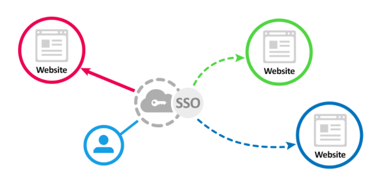
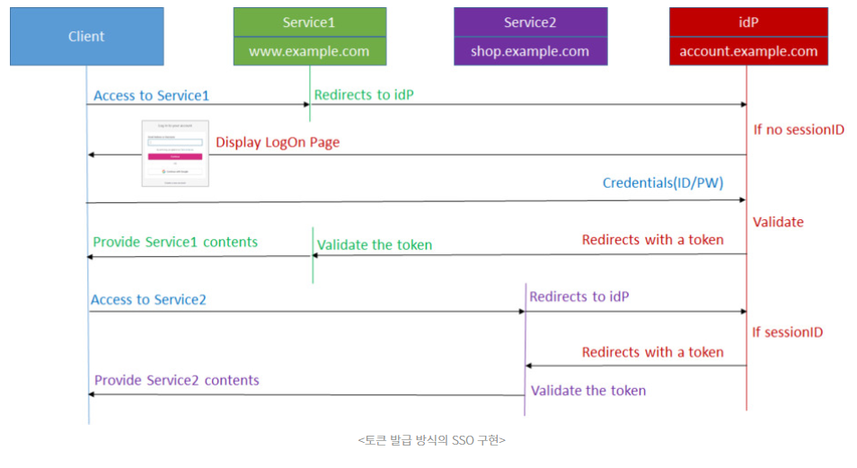

# SSO(Single Sign-On)
한 번의(Single) 로그인 인증(Sign-On)으로 여러 개의 서비스를 추가적인 인증 없이 사용할 수 있는 기술이다.
인증은 하나의 시스템(인증 서버)에서 수행하고, 그 인증 서버사 서비스를 각각 담당하는 서버에 인증 정보를 알려주는 방식이다.

주로 다양한 서비스를 유사한 도메인 혹은 동일한 탑 레벨 도메인(TLD : Top Level Domain)을 서비스하는 엔터프라이즈 서비스 제공자들이 사용자에게 간편한
로그인을 제공하기 위해 사용한다.

ex.
- Gmail에 Google 계정으로 로그인
- Youtube, Google Drice에서는 별도 로그인 없이 Gmail에 로그인한 Google계정을 동일하게 사용

## SSO를 구현하기 위한 기술 요소
SSO를 구현하는 여러방법 중에서 인증 토큰(authenticatoin token)을 사용한 방식에 대해서 알아보겠다.
- 토큰 : 최초 인증이 성공한 사용자에게 일종의 증표로 인증 서버가 발급하는 정보

예전의 웹 개발에서는 로그인에 성공한 사용자는 웹 서버와 Session을 맺고, **SessionId** 정보를 쿠키로 받아, 그 쿠키를 
로그인의 증표로 사용했다. 모든 요청 헤더에 SessionId 쿠키를 넣고 웹 서버에 접속을 하면, 웹 서버는 서버에 보관한 Session 정보와
 비교하여 유효하게 로그인한 사용자임을 확인하고 콘텐츠를 제공하는 방식이었다. 
 매번 요청마다 서버가 Session 정보를 확인해야하는 부담, 서버가 Session 정보를 어디엔가(DB 혹은 Redis) 저장해야 하는 번거로움과 복잡한 구현 방식이 단점이라 할 수 있다.

이에 반해 토큰 방식은 Session 방식과 다르게 서버가 각각 로그인한 사용자의 세션 정보를 따로 보관하지 않는다. 한번 인증 토큰이 클라이언트에게 발급하면,
클라이언트는 추후 요청보터는 그 토큰을 포함하고, 서버는 클라이언트 요청에 포함된 토큰을 그때그때 확인할 뿐이다.

## 토큰을 사용한 SSO 서비스 다이어그램

1. 사용자는 Service1에 접속하여 로그인 버튼을 클릭한다.
2. Service1은 인증 서비스(idP:Identity provider)로 해당 요청을 Redirect 한다.
3. 인증 서비스는 사용자에게 로그인 화면을 제공한다.
4. 사용자는 ID/PW (혹은 OAUTH2.0)을 입력한다.
5. 인증 서비스는 회원 DB와 비교하여 ID/PW가 올바르면 인증 토큰을 발급하며 Service1으로 돌려보낸다.
6. Service1은 발급된 토큰을 확인하고, 올바른 토큰이라면 사용자의 로그인 처리를 해준다.
7. 사용자는 Service2에 접속한다.
8. Service2는 이 사용자의 세션이 아직 유효한지 확인하고 유효하다면, Service2 용도의 토큰을 발급한다.
9. Service1은 발급된 토큰을 확인하고, 올바른 토큰이라면 사용자의 로그인 처리를 해준다.

일반적으로 토큰은 짧은 유효 시간을 갖는데 비해, 서버에는 세션 정보를 오랫동안 보관하고 그 기간 내에 재접속한 사용자를 지원할 수 있고 한번 
발급된 토큰만 믿을 수 없기 때문에 **여전히 세션이 필요하다.**

### 유효 시간이 만료된 토큰

- 인증 서버는 ID/PW를 DB에서 확인하고, 정상 로그인이면 AccessToken과 RefreshToken을 발행한다.
- AccessToken은 exp가 짧다. 만료되고 RefreshToken으로 인증 서버에게 AccessToken를 재요청한다.
- RefreshToken은 exp가 상대적으로 길고, 인증 서버의 세션 정보를 포함한다.
- AccessToken 재요청을 받은 인증 서버는 RefreshToken과 세션 정보를 비교 후 재발급해준다.
- RefreshToken 마저 유효 시간이 지나면, 사용자는 다시 ID/PW 로그인을 해야 한다.

